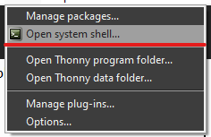
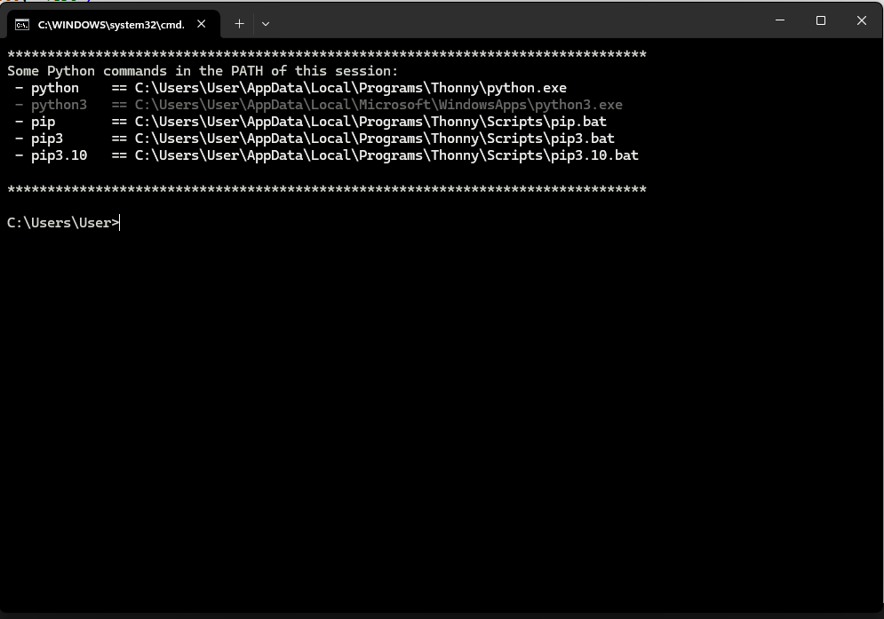
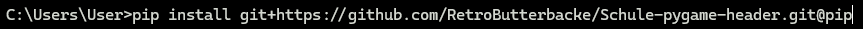
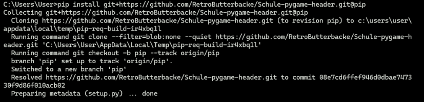

# Pygame Header

## Requirements
```
    python-3.7 min
    pygame / pygame-ce
    numpy
```

## Installation
### Manual 
Download the header and put it into the same directory as your script.


### For the following
Download and install git
Link: https://git-scm.com/downloads

### For Thonny
Under Tools you should find something called "Open system shell"



Now after you clicked on that, a new window will open.



Now you want to type in this command to install the header
```shell
$ pip install git+https://github.com/RetroButterbacke/Schule-pygame-header.git@pip
```



Now after the command has installed the header it should look something like this



At last you want to type "exit" and than continue onwards with the scripting.

### Localy on Laptop/PC
Open via the menu your terminal for windows it's on default cmd.
Now you want to type in the following command:
```shell
$ pip install git+https://github.com/RetroButterbacke/Schule-pygame-header.git@pip
```


Now after the command has installed the header it should look something like this


At last you want to type "exit" and than continue onwards with the scripting.

## Usage
```python
from graphics_h import *

init()

window = Window(widthL: int, height: int, caption: str, windowflags: List[int])
window.setClearColor(rgb(redL: int, green: int, blue: int))

input = InputListener()

def gameLoop():
    ...
    return

window.starGameLoop(gameLoop, escape_sequence: Union[Tuple[str, ...], str], framerate: int, input: InputListener)
```

## Classes

1. [vec2](#vec2)
2. [rgb](#rgb)
3. [rgba](#rgba)
4. [Timer](#Timer)
5. [Button](#Button)
6. [InputListener](#InputListener)
7. [Suface](#Surface)
8. [Window](#Window)

### vec2<a name="vec2"></a>
Creates a 2-Dimensional vector
``` python
vec2(x: int, y: int) -> vec2
vec2.convert(width: int, height: int, modifier: str) -> vec2
vec2.__mul__(factor: int) -> vec2
vec2.__add__(other: vec2) -> vec2
vec2.__sub__(other: vec2) -> vec2
vec2.dot(other: vec2) -> int
vec2.norm() -> float
vec2.normalized() -> Tuple[float, float]
```

#### Usage:
##### convert
Used for getting the corners of a Rect/Hitbox
``` python
vec = vec2(43, 20)
topleft = vec.convert(5, 10, "tl") ## returns: vec2(38, 10)
```
``` 
tl -> Topleft
tr -> Topright
bl -> Bottomleft
br -> Bottomright

ctl -> Center from the topleft var
ctr -> Center from the topright var
cbl -> Center from the bottomleft var
cbr -> Center from the bottomright var
```

##### multiply
Returns a new vector of the original vector multiplied by the factor
```python
vec = vec2(43, 20)
factor = 2

result = vec * factor ## returns: vec2(86, 40)
```

##### addition
Returns the results of the addition of vector 1 and vector 2
```python
vect1 = vec2(43, 20)
vect2 = vec2(50, 88)

vect3 = vect1 + vect2 ## returns: vec2(93, 108)
```

##### subtraction
Returns the results of the subtraction of vector 1 and vector 2
```python
vect1 = vec2(50, 88)
vect2 = vec2(43, 20)

vect3 = vect1 - vect2 ## returns: vec2(7, 68)
```

##### dot/scalar product
Returns the projection of vector 1 to vector 2
``` python
vect1 = vec2(5, 2)
vect2 = vec2(3, 9)

dot = vect1.dot(vect2) ## returns: 33
```

##### norm / magnitude
Returns the magnitude of the vector
``` python
vec = vec2(5, 9)

magnitude = vec.norm() ## returns: ~10.296
```

##### normalize
Returns the normalized vector
```python
vec = vec2(5, 9)

normalized = vec.normalize() ## returns: (~0,486, ~0,874)
```

### rgb<a name="rgb"></a>
Creates a rgb value
!! All values need to be between 0 and 255 !!
```python
rgb(red: int, green: int, blue: int) -> rgb
rgb.getRGBA(alpha: int = 255) -> rgba
```

#### Usage
##### getRGBA
Returns the rgba color of the color as long as alpha is between 0 and 255
```python
color = rgb(150, 50, 254)
color.getRGBA(150) ## returns: rgba(150, 50, 254, 150)
```

### rgba<a name="rgba"></a>
Creates a rba color
!! All values need to be between 0 and 255 !!
```python
rgba(red: int, green: int, blue: int, alpha: int) -> rgba
```

### Timer<a name="Timer"></a>
Creates a timer that can be used to update game variables
```python
Timer(delay: int, task: Callable) -> Timer
Timer.start() -> None
Timer.pause() -> None
Timer.unpause() -> None
Timer.stop() -> None
```

#### Usage
delay in milliseconds
```python
def foo():
    print("hello")

timer = Timer(1000, foo)

timer.start() ## now the timer will print 'hello' every second

--------------------------

timer.pause() ## pauses the timer

timer.unpause() ## lets the timer continue

--------------------------

timer.stop() ## finally we stop the timer
```

### Button<a name="Button"></a>
Creates a visual button on for user input
```python
Button(width: int, height: int, label: str, pos: vec2, onClick: Callable) -> Button
Button.draw(window: Window, design: int = 0, fontStyle: Union[str, None] = None, fontColor: rgb = rgb(0, 0, 0), outlined: bool = False, outline_depth: int = 0, color: Union[rgb, rgba] = rgba(255, 255, 255, 255), outlineColor: Union[rgb, rgba] = rgba(255, 255, 255, 255), border_radius: int = 20, texture: Union[None, str] = None, outlineTexture: Union[None, str] = None, transparency: int = 255, transparencyOutline: int = 255, rotation: int = 0) -> None
```

#### Usage
```python
window = Window(1000, 500, "Example")

def test():
    print("test")

button = Button(100, 50, vec2(500, 250), "Test", test) ## prints test as soon as clicked
window.addButton(button)

button.draw(window, 0, "Arial", rgb(0, 0, 0), True, 30, rgb(150, 150, 0), rgb(100, 100, 0)) ## draws the button with a background color of rgb(150, 150, 0) and a 30 pixel thick outline with the color rgb(100, 100, 0) and the label in the color black
```

##### designs
```
0 -> Normal rect
1 -> rect with rounded edges
```

### InputListener<a name="InputListener"></a>
```python
InputListener() -> InputListener
InputListener.set_wasPressed(function: Callable[[str], None]) -> None
InputListener.set_wasReleased(function: Callable[[str], None]) -> None
InputListener.set_isPressed(function: Callable[[str], None]) -> None
InputListener.isKeyPressed(key: str) -> bool
InputListener.wasKeyPressed(key: str) -> bool
InputListener.wasKeyReleased(key: str) -> bool
InputListener.isButtonPressed(button: str) -> bool
InputListener.wasButtonPressed(button: str) -> bool
InputListener.wasButtonReleased(button: str) -> bool
InputListener.isScrollDir(dir: str) -> bool
InputListener.getScrollSpeed() -> int
InputListener.hasMouseMoved() -> bool
```

#### Usage
Key and Button List [here](#keyList)

##### Automatical
###### set_wasPressed
Wants a function that handles the inputs with a parameter:   key: str 
This function will handle the event that the key or button was pressed in this moment

###### set_wasReleased
Wants a function that handles the inputs with a parameter:   key: str 
This function will handle the event that the key or button was released in this moment

###### set_isPressed
Wants a function that handles the inputs with a parameter:   key: str 
This function will handle the event that the key or button is Pressed when it is called

##### Manual (not recommended)
###### isKeyPressed
Returns True if the key is down

###### wasKeyPressed
Returns only in the moment the key was pressed True

###### wasKeyReleased
Returns only in the moment the key was Released True

###### isButtonPressed
Returns True if the button is down

###### wasButtonPressed
Returns only in the moment the button was pressed True

###### wasButtonReleased
Returns only in the moment the button was Released True

##### Other
###### isScrollDir
Wants the dir either "UP" or "DOWN" and returns if the user scrolls in this dir

###### getScrollSpeed
Returns with what speed the user scrolls the mouse wheel default 0

###### hasMouseMoved
Returns True in the moment the mouse has moved


### Surface<a name="Surface"></a>
Creates a Surface to draw on beside the main screen
```python
Surface(width: int, height: int) -> Surface
Surface.setClearColor(color: rgb) -> None
Surface.clear() -> None
Surface.set_colorkey(color: rgb) -> None
Surface.set_alpha(alpha: int = 255) -> None
Surface.drawLine(pos1: vec2, pos2: vec2, color: Union[rgb, rgba] = rgba(255, 255, 255, 255), depth: int = 1) -> None
Surface.drawRect(pos: vec2, width: int, height: int, color: Union[rgb, rgba] = rgba(255, 255, 255, 255), texturePath: Union[None, str] = None, *, colorkey: Union[rgb, None] = None, lineDepth: int = 0, rotation: int = 0, transparency: int = 255, border_radius: int = 0) -> None
Surface.drawCircle(pos: vec2, radius: int, color: Union[rgb, rgba] = rgba(255, 255, 255, 255), texturePath: Union[None, str] = None, *, colorkey: Union[rgb, None] = None, lineDepth: int = 0, rotation: int = 0, transparency: int = 255) -> None
Surface.drawTriangle(pos: vec2, width: int, height: int, color: Union[rgb, rgba] = rgba(255, 255, 255, 255), texturePath: Union[None, str] = None, *, colorkey: Union[rgb, None] = None, lineDepth: int = 0, rotation: int = 0, transparency: int = 255) -> None
Surface.drawTexture(pos: vec2, width: int, height: int, texturePath: str, *, colorkey: Union[rgb, None] = None, rotation: int = 0, transparency: int = 255) -> None
Surface.drawText(pos: vec2, width: int, height: int, text: str, color: Union[rgb, rgba] = rgba(0, 0, 0, 255), fontStyle: Union[None, str] = None, *, rotation: int = 0, transparency: int = 255) -> None
Surface.drawSurface(topleft: vec2, surface: 'Surface') -> None
```

#### Usage
```python
surface = Surface(1000, 500)

surface.clear() ## clears the surface with the given ClearColor default black

surface.setClearColor(rgb(red, green, blue)) ## set the ClearColor

surface.set_colorkey(rgb(red, green, blue)) ## set the color that should be interpreted as transparent

surface.selt_alpha(alpha) ## set the transparency/alpha value of the Surface

### The draw functions will be explained in the Window class
```

### Window<a name="Window"></a>
Creates a window where pygame will render
```python
Window(width: int, height: int, caption: str, window_flags: List[str]) -> Window
Window.getDeltaTime() -> float
Window.getTimeDiff() -> float
Window.getFPS() -> int
Window.getLiteralFPS() -> float
Window.setFrameRate(rate: int) -> None
Window.drawLine(pos1: vec2, pos2: vec2, color: Union[rgb, rgba] = rgba(255, 255, 255, 255), depth: int = 1) -> None
Window.drawRect(pos: vec2, width: int, height: int, color: Union[rgb, rgba] = rgba(255, 255, 255, 255), texturePath: Union[None, str] = None, *, colorkey: Union[rgb, None] = None, lineDepth: int = 0, rotation: int = 0, transparency: int = 255, border_radius: int = 0) -> None
Window.drawCircle(pos: vec2, radius: int, color: Union[rgb, rgba] = rgba(255, 255, 255, 255), texturePath: Union[None, str] = None, *, colorkey: Union[rgb, None] = None, lineDepth: int = 0, rotation: int = 0, transparency: int = 255) -> None
Window.drawTriangle(pos: vec2, width: int, height: int, color: Union[rgb, rgba] = rgba(255, 255, 255, 255), texturePath: Union[None, str] = None, *, colorkey: Union[rgb, None] = None, lineDepth: int = 0, rotation: int = 0, transparency: int = 255) -> None
Window.drawTexture(pos: vec2, width: int, height: int, texturePath: str, *, colorkey: Union[rgb, None] = None, rotation: int = 0, transparency: int = 255) -> None
Window.drawText(pos: vec2, width: int, height: int, text: str, color: Union[rgb, rgba] = rgba(0, 0, 0, 255), fontStyle: Union[None, str] = None, *, rotation: int = 0, transparency: int = 255) -> None
Window.drawSurface(topleft: vec2, surface: 'Surface') -> None
Window.getMousePos() -> vec2
Window.addButton(button: Button) -> None
Window.setClearColor(color: rgb) -> None
Window.get_width() -> int
Window.get_height() -> int
Window.get_size() -> Tuple[int, int]
Window.clear() -> None
Window.startGameLoop(gameLoop: Callable, escape_sequence: Union[Tuple[str, ...], str], framrate: int, input: InputListener) -> None
Window.quit() -> None
``` 

#### Usage
For these examples we use a 1000x500 wide window

##### getDeltaTime
Returns the current delta time that the pc can handle

##### getTimeDiff
This value will count from 0.0 to 1.0 so it returns the current difference to the last second

##### getFPS
Returns the fps of the window in integer format

##### getLiteralFPS
Returns the Literal fps in float's

##### setFrameRate
Sets the framrate cap at what value it gets
!! warning: this value will be, as soon as the gameloop gets started, ovewritten with the framerate the gameLoop is given this function is for the later on change !!

#### drawLine
Draws a Line from pos1 to pos2
```python
window.drawLine(vec2(0,0), vec2(1000, 500), rgb(150, 0, 0), 2)
## this will draw a line from the topleft corner to the bottomright one with the thickness of 2 pixel and the color red
```

#### drawRect
Draws a rect at the given center! with the given width and height
```python
window.drawRect(vec2(500, 250), 100, 50, rgb(150, 0, 0))
## this will draw a 100 pixel wide and 50 pixel heigh rectangle with the color red at the center of the window
```

#### drawCircle
Draws a circle at the given center! with the given radius
```python
window.drawCircle(vec2(500, 250), 50, rgb(150, 0, 0), lineDepth=5)
## this will draw a circle wich is not filled and has only a outline with a thickness of 5 pixel is at the center of the window and has a radius of 50 pixel
```

#### drawTriangle
Draws a Triangle at the given center with the given width and height where the top spike is the width devided by 2
```python
window.drawTriangle(vec2(500, 250), 100, 50, rgb(0, 0, 150))
## this will draw a triangle at the center of the window with the color blue and has a width of 100, and a height of 50 where the top spike is at (500, 225)
```

#### drawTexture
Draws a Texture at the given center with the given width and height
```python
window.drawTexture(vec2(500, 250), 1000, 500, "./test.jpg", transparency=127)
## this will draw a texture all over the screen with the given file path of the text.jpg which is in the same folder as the script, also the transparency is at '0.5' which makes the pictur/texture only half visible
```

#### drawText
Draws a text at the given center with the given width and height
```python
window.drawText(vec2(500, 250), 200, 100, "Test", rgb(150, 0, 0), "Arial")
## this will draw the text "Test" onto the center of the window with the font style "Arial" and the color red
```

#### drawSurface
Draws the given surface onto the screen at the given topleft

#### getMousePos
Returns the current pos of the mouse as vec2

#### addButton
Adds the given Button instance to the windows listener

#### setClearColor
Sets the ClearColor to the given color

#### get_width
Returns the windows width

#### get_height
Returns the windows height

#### get_size
Returns the windows size as Tuple

#### clear
Clears the window to the given ClearColor

#### startGameLoop
Runs the given gameLoop at the given frame rate while the game is running listens for the escape_sequence to escape on this sequence as long as a InputListener is given else the escape_sequence wont work cause the window won't listen to user input, else then the X ontop of the window

#### quit
Stops gameLoop and closes window

[Example](test_new.py)

## Key and Button List<a name="keyList"></a>
### Keys:
```
A
B
C
D
E
F
G
H
I
J
K
L
M
N
O
P
Q
R
S
T
U
V
W
X
Y
Z
0
1
2
3
4
5
6
7
8
9
RETURN
ESCAPE
BACKSPACE
TAB
SPACE
UP
DOWN
LEFT
RIGHT
LEFT CTRL
RIGHT CTRL
LEFT SHIFT
RIGHT SHIFT
LEFT ALT
RIGHT ALT
KP_0
KP_1
KP_2
KP_3
KP_4
KP_5
KP_6
KP_7
KP_8
KP_9
KEYPAD ENTER
KEYPAD PLUS
KEYPAD MINUS
KEYPAD MULTIPLY
KEYPAD DIVIDE
F1
F2
F3
F4
F5
F6
F7
F8
F9
F10
F11
F12
```
### Buttons
```
LEFT
RIGHT
MIDDLE
WHEEL UP
WHEEL DOWN
```
